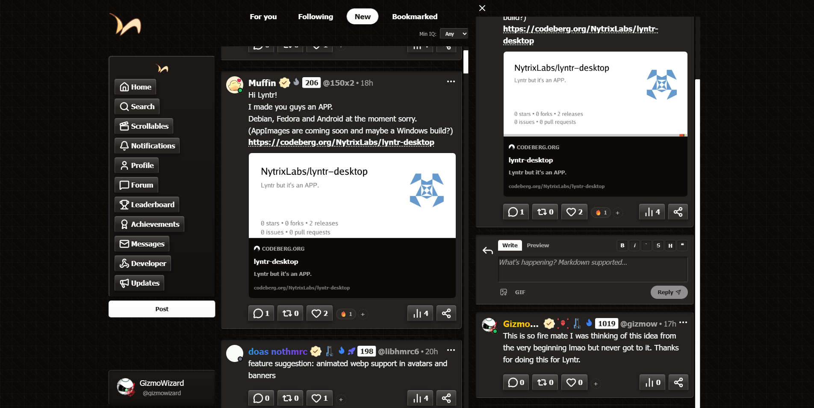
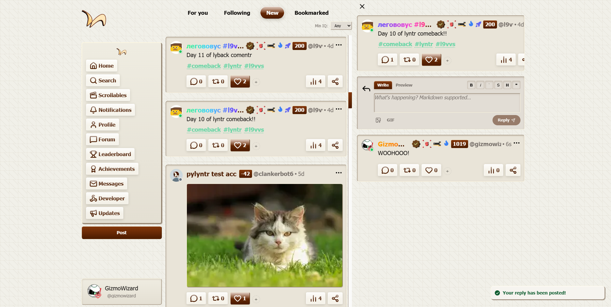
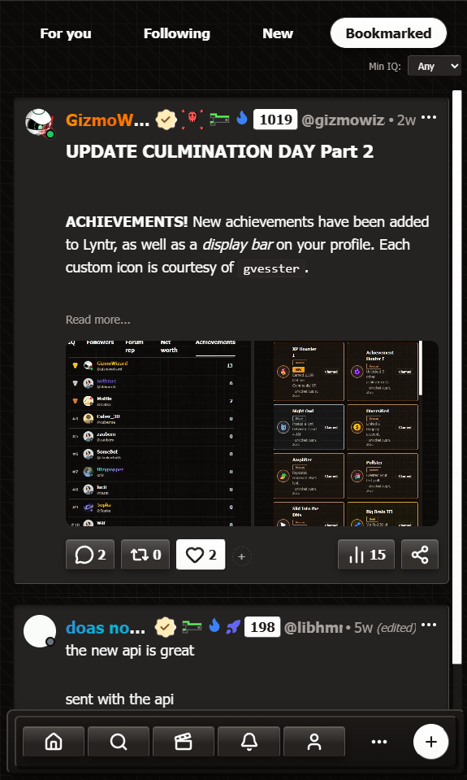

<h1 style="font-size: 48px"><a href="https://1lyn.tr">1lyn.tr</a> - the micro-blogging social media with a twist</h1>
[Privacy Policy](https://1lyn.tr/privacy) | [Terms of Service](https://1lyn.tr/tos) | [License](https://github.com/GizmoWizardNet/lyntr/blob/main/LICENSE.md)

Official open source repository for [lyntr](https://1lyn.tr). Changes to this README to improve it are greatly appreciated.

## Built with

- **Frontend:** SvelteKit + Svelte 5
- **Language:** TypeScript
- **Styling:** Tailwind CSS
- **Database:** PostgreSQL / Supabase
- **ORM:** Drizzle
- **Realtime:** WebSockets
- **Object storage:** MinIO
- **Caching / rate limiting:** Upstash Redis
- **Deployment:** Docker

The official Discord server for all things Lyntr can be found here: https://discord.gg/y5PA8uS5Tj

## Screenshots

  
  
  

## Development

Lyntr is actively developed, by the community and myself.

See the [development updates](https://1lyn.tr/updates) for recent changes
and the [GitHub issues](https://github.com/GizmoWizardNet/lyntr/issues) for current work.

### Please refer to the [MIT License](https://opensource.org/license/mit) for more license information.

Created by GizmoWizard, under GizmoWizardNet, 2026.
